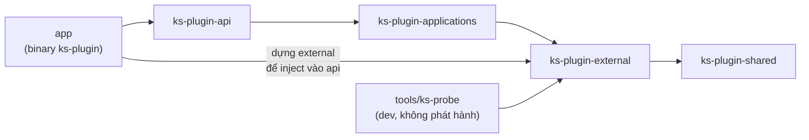

# Cargo workspace

> **Phần 1/7** · mục lục: [README.md](README.md)

## Vị trí mã nguồn

`MacOS/ks-plugin/` — một Cargo workspace, đặt song song với `Window/ks.plugin/`. Tên crate dùng `-` vì Cargo
không cho dấu `.`; còn lại **soi gương** bốn project C# để người đọc chuyển qua lại không phải dịch.

```text
MacOS/ks-plugin/
├─ Cargo.toml                 [workspace] + [workspace.dependencies] ghim phiên bản một chỗ
├─ rust-toolchain.toml        ghim toolchain stable + hai target darwin
├─ crates/
│  ├─ ks-plugin-shared/       hằng số, envelope, DTO serde, lỗi dùng chung
│  ├─ ks-plugin-external/     chạm thẻ (PC/SC, APDU, PKCS#15, driver) + dịch vụ hệ điều hành
│  ├─ ks-plugin-applications/ nghiệp vụ mỏng: CertificateService, SigningService, PluginService
│  └─ ks-plugin-api/          router axum, handler, CORS, kiểm Host, TLS
├─ app/                       binary `ks-plugin`: dựng mọi thứ, chạy vòng lặp giao diện
├─ tools/ks-probe/            CLI đo thẻ chỉ-đọc cho bước 1–3, không phát hành
└─ packaging/macos/           Info.plist, distribution.xml, trang wizard, script cài/gỡ, dựng .app + .pkg
```

## Chiều phụ thuộc



Trình biên dịch ép chiều này: `external` không thấy `api`, `applications` không thấy axum. Giống
`external → shared` bên C#.

## Ánh xạ từ `ks.plugin` (C#)

| C# (`Window/ks.plugin`) | Rust | Ghi chú |
|---|---|---|
| `ks.plugin.shared/Constants/*` | `ks-plugin-shared::constants` | `PORT = 17739`, `DEFAULT_ORIGINS`, `SESSION_IDLE_TIMEOUT_MINUTES = 15`; khớp `KySoConstants.IdleTimeoutMinutes` |
| `ApiResponse`, `StatusCodeE` | `ks-plugin-shared::response::ApiResponse<T>` | `status` ra số nhờ `serde_repr` |
| DTO ở `applications/*/Dtos`, `external/*/Dtos` | `ks-plugin-shared::dto` | Một chỗ cho mọi DTO — Rust không cần tách theo layer để né vòng phụ thuộc |
| `ICertificateProvider` | trait `CertificateProvider` | Cài đặt: `CardCertificateProvider` (PC/SC) |
| `ITokenVerifier` | trait `TokenVerifier` | Ký thử rồi nhả kết nối — không giữ phiên |
| `ISigningSession` | trait `SigningSession` | Cài đặt gửi `CardCommand` sang `card-worker`, xem [02-threading.md](02-threading.md) |
| `IChungThuSoService`, `IKySoService`, `IPluginService` | `CertificateService`, `SigningService`, `PluginService` trong `applications` | Không cần trait: không có cài đặt thứ hai |
| `Controllers/*` | `ks-plugin-api::routes::{plugin, certificates, signing}` | Một module một controller |
| `external/Tray`, `MotBanChay`, `StatusWindow` | `ks-plugin-external::platform` + `app` | Bản Windows đã bỏ console, dùng cửa sổ trạng thái; trên Mac log ra file |
| `CauHinhCaiDat` (registry `MoiTruong`) | `ks-plugin-external::platform::InstallConfig` | Đọc `config.json` do bộ cài `.pkg` ghi, xem [07-build-pipeline.md](07-build-pipeline.md) |
| DI container | dựng tay trong `main`, `Arc<dyn Trait>` vào `State` của axum | Rust không có DI; dựng một lần là đủ |

## Mã phụ thuộc hệ điều hành

Mọi thứ trừ `platform` biên dịch và chạy được **trên Windows** — bước 1–4 của kế hoạch làm trọn trên máy dev
Windows với token đang có. Phần riêng macOS đặt sau `#[cfg(target_os = "macos")]`; trên Windows `platform` có
bản rỗng đủ để `cargo build` sạch.

> **Tiếp:** [02-threading.md](02-threading.md) — threading model: ai chạy trên thread nào, nói chuyện qua channel nào.
