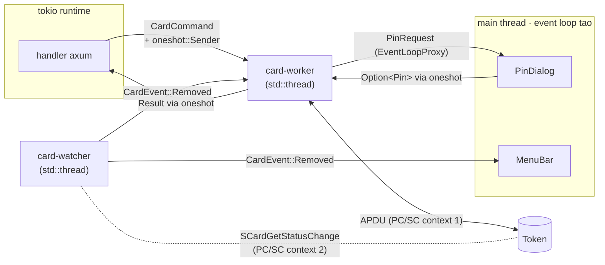
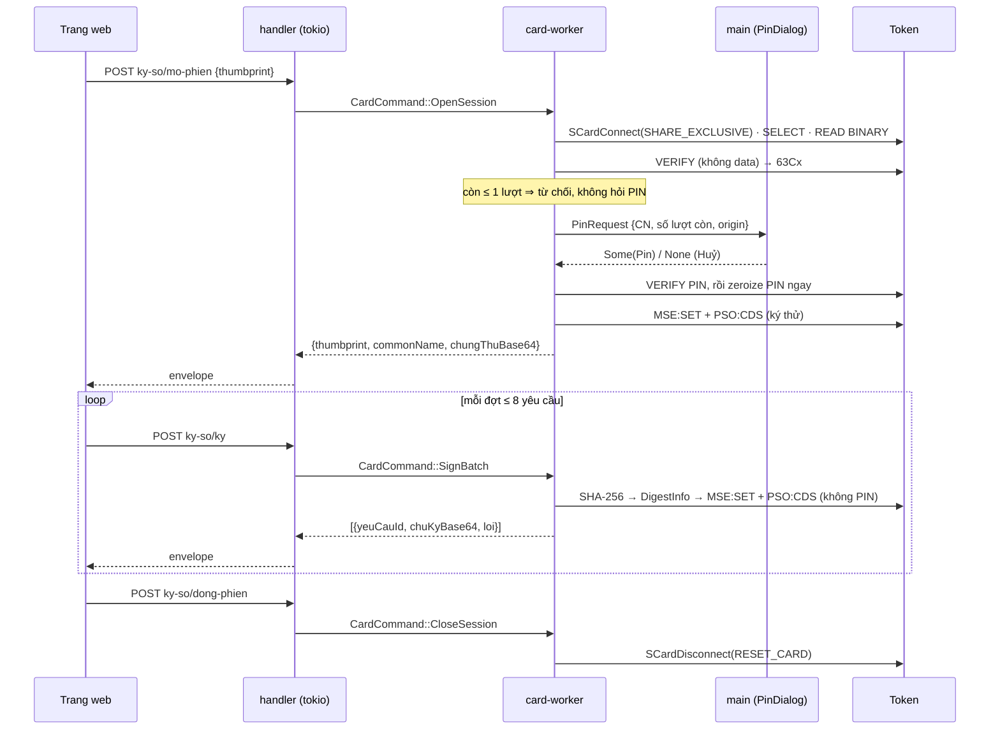

# Threading model

> **Phần 2/7** · trước: [01-workspace.md](01-workspace.md) · mục lục: [README.md](README.md)

## Bốn thread, mỗi thread một việc

| Thread | Chạy gì | Vì sao tách |
|---|---|---|
| **`main`** | Event loop `tao` (AppKit): `MenuBar`, `PinDialog`, notification | macOS bắt mọi thứ AppKit tạo và chạy trên main thread; làm ngược là crash lúc tạo tray icon |
| **`tokio`** (multi-thread runtime) | HTTP server axum, handler | Handler async không được gọi PC/SC trực tiếp — lời gọi blocking treo worker của tokio |
| **`card-worker`** (`std::thread`) | Giữ PC/SC context + card connection + session state | Chỗ **duy nhất** chạm thẻ; xử lý command tuần tự nên đóng vai `lock (_khoa)` bên C# |
| **`card-watcher`** (`std::thread`) | PC/SC context **thứ hai**, block ở `SCardGetStatusChange` | Lời gọi blocking dài; dùng chung context thì lượt ký phải xếp hàng sau lượt chờ |

## Channels



- `card-worker` nhận bằng `mpsc::Receiver::recv_timeout(1 phút)`: session idle quá **15 phút** thì **chủ động đóng**,
  không đợi lượt ký kế tiếp như bản C#. Handler chờ bằng `tokio::sync::oneshot` — không block worker.
- `PinDialog` trả `Option<Pin>`: `None` là bấm Huỷ ⇒ lỗi "Người dùng huỷ nhập PIN", **không** tốn lượt thử.

## `CardCommand` (minh hoạ hình dạng)

```rust
enum CardCommand {
    ListCertificates,                                 // chung-thu-so: không PIN
    VerifyToken { thumbprint: String },               // kiem-tra-token: PIN, ký thử, nhả ngay
    OpenSession { thumbprint: String },               // mo-phien: PIN một lần, giữ connection
    SignBatch { items: Vec<Vec<u8>> },                // ky: cả đợt, lỗi riêng từng phần tử
    CloseSession,
    CardRemoved,                                      // từ card-watcher
}
```

Mỗi command kèm `oneshot::Sender<Result<_, CardError>>`; xử lý **xong command này mới sang command kế**, nên hai
tab gọi `ky` cùng lúc vẫn ký tuần tự đúng như token đòi.

## Session lifecycle



- **Giữ connection = giữ key handle** của bản Windows: authenticated state sống trên thẻ tới khi reset, PIN **không**
  nằm lại trong RAM. `SHARE_EXCLUSIVE` suốt session để process khác không mượn được state đó.
- Đóng bằng `RESET_CARD` (không `LEAVE_CARD` — để lại thẻ đã nhập PIN cho kẻ connect sau) cả khi idle 15 phút,
  `CardRemoved`, hay thoát app.
- ⚠️ Nếu khoá mang thuộc tính *user consent*, thẻ đòi `VERIFY` trước **mỗi** chữ ký — phải đo ở bước 3; khi đó
  "một PIN cho cả lô" không giữ được mà không cache PIN, và cache PIN là **cấm**. Phải quay lại hỏi.

**Graceful shutdown**: menu "Thoát" ⇒ `main` gửi shutdown signal cho tokio (`with_graceful_shutdown`) và
`CloseSession` cho `card-worker`, chờ cả hai xong rồi mới thoát event loop `tao`.

> **Tiếp:** [03-card-layer.md](03-card-layer.md) — card layer, từ PC/SC tới chữ ký.
