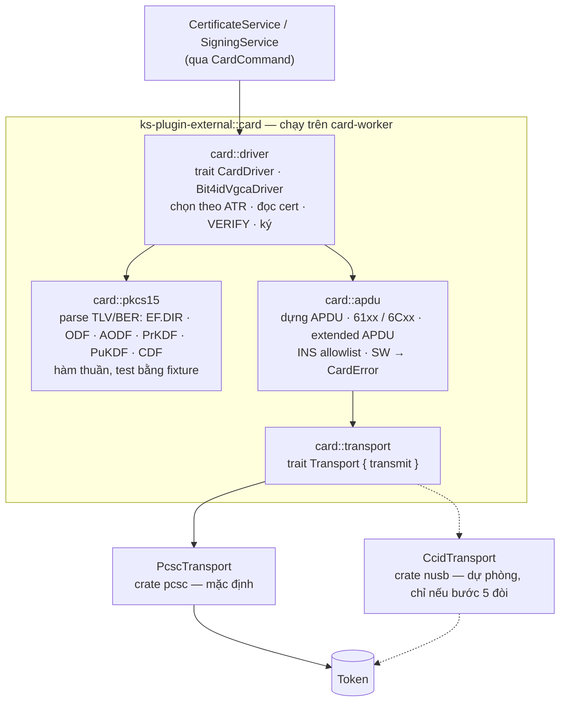
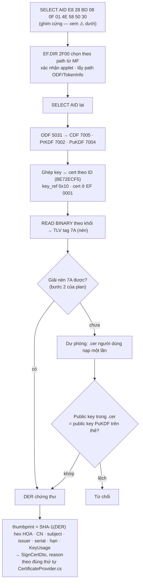

# Card layer (`ks-plugin-external::card`)

> **Phần 3/7** · trước: [02-threading.md](02-threading.md) · mục lục: [README.md](README.md)

Hằng số đo trên thẻ thật ở [../01-token-vgca.md](../01-token-vgca.md). Mọi thứ trong layer này chạy trên
**`card-worker`**, không `async`.

## Bốn module



Tách `transport` khỏi `driver` để đường `nusb` cắm vào mà driver không đổi dòng nào — đúng cách "Ký số đa năng"
tách `ccid_transport.rs`.

## `CardDriver`

```rust
// Minh hoạ hình dạng.
trait CardDriver {
    fn detect(atr: &[u8]) -> bool;                                    // ATR có "B4D", EF.DIR "JCOP4Bit4ID"
    fn read_certificates(&mut self) -> Result<Vec<CardCertificate>>;  // không PIN
    fn remaining_pin_tries(&mut self) -> Result<u8>;                  // VERIFY rỗng → 63Cx
    fn verify_pin(&mut self, pin: &Pin) -> Result<()>;                // VERIFY ref 0x03
    fn sign_digest_info(&mut self, key_ref: u8, digest_info: &[u8]) -> Result<Vec<u8>>;
}
```

Chỉ **một** driver ở bản đầu: token Ban Cơ yếu (bit4id JCOP4, RSA 3072). ATR không khớp ⇒ đầu đọc vẫn hiện
trong `storeDiagnostics` kèm "Chưa hỗ trợ loại token này", không ném.

## Read certificates — không PIN



⚠️ Đo trên thẻ thật (2026-09-25): EF.DIR **chỉ đọc được sau khi đã chọn applet**, và chọn bằng path từ MF
(`00 A4 08 0C 02 2F00`); lúc thẻ còn ở Card Manager thì `6A86`. Vì vậy AID phải ghim sẵn trong
`VGCA_APPLET_AID`, EF.DIR chỉ dùng để xác nhận. Chọn xong EF.DIR là rời DF của applet ⇒ phải `SELECT AID` lại rồi mới
chọn `5031`… bằng FID tương đối `00 A4 00 0C` (không FCI, ít byte hơn). Đừng "sửa" bằng path `3F00/5015/…` — thẻ này
không dùng DF `5015`.

Các file descriptor được cấp 2048 byte nhưng dữ liệu chỉ vài chục byte, còn lại là `00`. `read_selected_file_until`
dừng ngay khi cấu trúc TLV đủ (`tlv::padded_length`; chứng thư `7A` dùng độ dài khai trong header): lượt đọc cấu trúc
thẻ giảm từ ~1,8 s xuống ~0,8 s (đo `ks-probe dump`, bản release, Windows).

`.cer` được phép lưu vì là dữ liệu công khai, nhưng khoá trên thẻ vẫn **đọc lại mỗi lần** — không bao giờ trả cert
của token đã rút.

## Signing

```text
data (SignedAttributes) ─SHA-256─> h (32 byte)
DigestInfo = 30 31 30 0D 06 09 60 86 48 01 65 03 04 02 01 05 00 04 20 || h
MSE:SET   00 22 41 B6  [84 01 10] [80 01 <thuật toán>]        ← key ref 0x10; mã thuật toán phải đo
PSO:CDS   00 2A 9E 9A  Lc DigestInfo  Le                      ← chữ ký 384 byte > 256 ⇒ Le mở rộng hoặc 61xx
```

Sau khi thẻ trả chữ ký, **tự kiểm** bằng khoá công khai (`rsa::RsaPublicKey::verify`) trước khi trả về — thẻ trả
rác thì báo lỗi ở plugin chứ không để máy chủ lắp một CMS hỏng. Kiểm thêm chứng thư không đổi giữa phiên.

Bước 3 thử cả hai biến thể: thẻ nhận `DigestInfo` đầy đủ, hay chỉ nhận hash và tự bọc.

## PIN retry guard — không được sai

| Luật | Cách làm |
|---|---|
| Hỏi lượt thử **trước** khi hiện hộp PIN | `VERIFY` không dữ liệu → `63Cx`; `9000` là đang xác thực sẵn |
| Còn **≤ 1** lượt ⇒ **từ chối**, không gửi `VERIFY` | Báo "Token chỉ còn 1 lần thử PIN — mở khoá bằng công cụ của Ban Cơ yếu" |
| PIN 4–16 byte, UTF-8, không NUL, đệm `0xFF` theo AODF | Kiểm **trước** khi gửi — sai định dạng không được tốn lượt |
| PIN sống trong `Zeroizing<Vec<u8>>` | Xoá ngay sau `VERIFY`, kể cả khi lỗi |
| Không bao giờ gửi `UPDATE BINARY`, `CHANGE REFERENCE DATA`, `RESET RETRY COUNTER`, lệnh GlobalPlatform | Danh sách INS cho phép ghim trong `apdu`, INS lạ ⇒ panic ở debug, lỗi ở release |

> **Tiếp:** [04-api-layer.md](04-api-layer.md) — API layer, sáu route trên axum.
