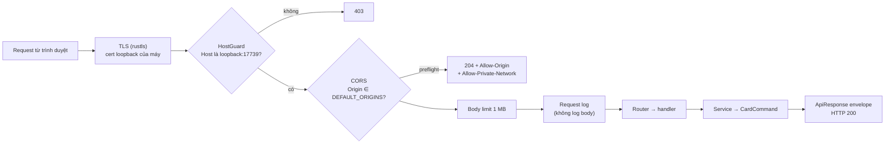

# API layer (`ks-plugin-api`)

> **Phần 4/7** · trước: [03-card-layer.md](03-card-layer.md) · mục lục: [README.md](README.md)

## Routes — đúng hợp đồng

Hợp đồng còn **sáu route**: `POST api/plugin/ky-so/do-toc-do` đã bỏ ở cả hai bản (macOS 2026-09-25, Windows
2026-10-05) — route đo tốc độ mở session và ký tới 100 lượt thật trên token, một bề mặt chạm token không phục vụ
người ký. Không đăng ký route này. Đo `T` khi phát triển dùng `ks-probe bench`.

| Method | Route | Handler gọi | PIN |
|---|---|---|---|
| GET | `api/plugin/trang-thai` | `PluginService::status` — không chạm thẻ | không |
| GET | `api/plugin/chung-thu-so?onlySignable=` | `CardCommand::ListCertificates` | không |
| POST | `api/plugin/chung-thu-so/kiem-tra-token` | `CardCommand::VerifyToken` | **có** |
| POST | `api/plugin/ky-so/mo-phien` | `CardCommand::OpenSession` | **có** |
| POST | `api/plugin/ky-so/ky` | `CardCommand::SignBatch` (cả đợt) | không |
| POST | `api/plugin/ky-so/dong-phien` | `CardCommand::CloseSession`, trả `true` | không |

## Envelope và error handling

- Mọi phản hồi HTTP **200**, trạng thái thật nằm trong envelope — y như `BaseController.OkException`:
  thành công `{status:1, data, code:200, message:"Ok"}`, lỗi `{status:0, data:null, code:500, message}`.
- `message` lỗi là câu tiếng Việt đọc được, không kèm stack, không kèm dữ liệu đem ký.
- Handler trả `Result<Json<ApiResponse<T>>, ApiError>`; `impl IntoResponse for ApiError` gói thành envelope lỗi.
- Body JSON hỏng: axum mặc định trả 400/422 văn bản trần — **phải** thay bằng extractor riêng trả envelope lỗi,
  để FE chỉ có một cách đọc.

## DTO — trùng tên trường JSON tuyệt đối

```rust
#[derive(Serialize)] #[serde(rename_all = "camelCase")]
struct SignCertDto { subject: String, common_name: String, /* … */ source: CertSource, reason: Option<String> }

#[derive(Serialize_repr)] #[repr(u8)]
enum CertSource { Local = 0, Server = 1, UsbToken = 2 }   // bản Mac luôn trả 2
```

- `Option::None` ra `null` (không `skip_serializing_if`) — FE đang đọc `reason: null` là "Ký được".
- `validFrom` / `validTo` định dạng `dd/MM/yyyy HH:mm:ss` theo **giờ máy** — `chrono::Local`.
- Body vào nhận `#[serde(default)]` cho mọi trường, giống model binding của ASP.NET khi thiếu trường.
- ⚠️ ASP.NET đọc tên trường **không phân biệt hoa thường**, serde thì có. FE hiện gửi camelCase nên khớp; nếu gặp
  lệch thì thêm `#[serde(alias)]` cho đúng trường đó, đừng viết deserializer bỏ qua hoa thường cho mọi thứ.
- `keyProvider` bản Mac: `"PC/SC: <tên đầu đọc>"`; `storeDiagnostics`: mỗi đầu đọc một dòng (tên, ATR, có thẻ
  không, driver nào nhận) — thay cho dòng "CurrentUser\My: n chứng thư".

## Middleware stack (theo thứ tự request đi qua)



Origin lạ thì request vẫn tới handler (CORS không chặn phía server), chỉ là trình duyệt không cho JavaScript đọc
kết quả — đúng hành vi bản C#.

1. **`HostGuard`** — chỉ nhận `127.0.0.1:17739`, `localhost:17739`, `[::1]:17739`; lệch ⇒ 403. Chặn DNS rebinding,
   thứ CORS không che. Không đổi hợp đồng: trình duyệt gọi đúng loopback vẫn qua.
2. **CORS** (`tower-http::cors::CorsLayer`) — origin lấy từ `DEFAULT_ORIGINS`, **cùng danh sách** với
   `PluginConstants.OriginMacDinh`; bật `allow_private_network(true)` cho preflight của Chrome (Private/Local
   Network Access). Vẫn chỉ là điều kiện để trình duyệt đọc được, **không** phải hàng rào.
3. **Giới hạn thân request** — `ky` mỗi đợt tối đa 8 yêu cầu × vài KB; trần 1 MB là thừa.
4. **Log** — method, route, thời gian, mã kết quả. Không log body.

## Listener và TLS

- Bind **cả** `127.0.0.1:17739` và `[::1]:17739` — bản C# `ListenLocalhost` cũng nghe cả hai.
- Trên macOS: **HTTPS** bằng `axum-server` + `rustls`, chứng thư do máy tự sinh ở lần chạy đầu (xem
  [05-macos-platform.md](05-macos-platform.md)). Safari chặn `http://127.0.0.1` từ trang `https://` nên không có
  đường khác. Đổi scheme là thay đổi phía FE — **D2 đã duyệt**, xem [../plan/README.md](../plan/README.md).
- Trên Windows (chỉ lúc phát triển bước 4): HTTP trần để chạy thử với FE bằng Chrome như plugin C#.
- Cổng đã có tiến trình khác giữ ⇒ không mở cổng khác; báo lỗi rõ trên menu bar và thoát. FE dò đúng một cổng.

> **Tiếp:** [05-macos-platform.md](05-macos-platform.md) — macOS platform layer.
