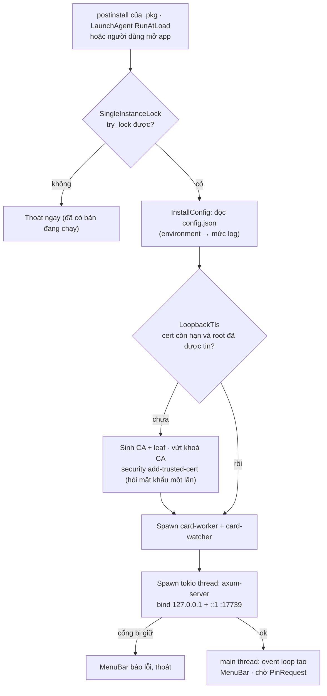

# macOS platform (`ks-plugin-external::platform` + `app`)

> **Phần 5/7** · trước: [04-api-layer.md](04-api-layer.md) · mục lục: [README.md](README.md)

## Startup flow

Việc **cài** do bộ cài `.pkg` lo (xem [07-build-pipeline.md](07-build-pipeline.md)), app chỉ lo **chạy** — giống tách
`bo-cai.nsi` khỏi `Ký số plugin.exe` bên Windows.



## `MenuBar` — không icon Dock

- `tao` dựng vòng lặp sự kiện, `ActivationPolicy::Accessory` + `LSUIElement = true` trong `Info.plist`: chạy nền,
  không icon Dock — đúng hình dạng `VGCA VCTKManager.app` của Ban Cơ yếu.
- `tray-icon` + `muda`: menu gồm dòng trạng thái (đang nghe / phiên đang mở với CN nào / token đã rút), "Đóng phiên
  ký", "Xuất báo cáo chẩn đoán", "Mở thư mục log", "Tự khởi động" (bật/tắt), "Gỡ cài đặt", "Thoát". Bản C# có
  "Hiện console" — Mac bỏ, thay bằng mở thư mục log.

## `PinDialog` — tự vẽ, nên phải vẽ cho đúng

**D1 đã duyệt (2026-09-25): plugin tự dựng UI hộp PIN.** Làm bằng AppKit thật (`objc2-app-kit`), không egui/OpenGL:

- Cửa sổ riêng của plugin (`NSPanel`, floating) với `NSSecureTextField`. `NSSecureTextField` khi có focus tự bật **Secure Event
  Input** của macOS — tiến trình khác không đọc được phím gõ vào ô này.
- Gọi `NSApp.activate` trước khi `runModal` ⇒ hộp PIN luôn nổi **trên** trình duyệt — chữa luôn bệnh "hộp PIN chìm"
  mà bản Windows đang treo.
- Hộp ghi rõ: tên token, CN chứng thư, **số lượt thử còn lại**, và website nào đang xin (Origin của request mở
  phiên) — người dùng biết mình đang mở khoá cho ai.
- Đọc chuỗi từ ô ⇒ chép ngay vào `Zeroizing<Vec<u8>>`, xoá nội dung ô, gửi qua `oneshot` cho `card-worker`. Không
  log, không `Debug` cho kiểu `Pin` (tự `impl Debug` in `"***"`).

## `LaunchAgentInstaller` — tự khởi động

Plist `~/Library/LaunchAgents/vn.ynap.kysoplugin.plist` (`RunAtLoad`, `KeepAlive = { SuccessfulExit = false }` — sập thì dựng
lại, bấm Thoát thì thôi). **Script `postinstall` của `.pkg` ghi lần đầu**; component này trong app lo bật/tắt từ menu
và gỡ khi "Gỡ cài đặt" (tắt LaunchAgent, gỡ root loopback khỏi keychain, xoá `Application Support`, `pkgutil --forget`,
chuyển app vào Thùng rác — `.pkg` của macOS không có trình gỡ như Apps & Features). Không dùng `SMAppService`: nó đòi
bundle ký chuẩn, bản ad-hoc dễ bất ngờ.

## `SingleInstanceLock` — một bản chạy

Khoá file `~/Library/Application Support/KySoPlugin/ks-plugin.lock` bằng `std::fs::File::try_lock` (std từ Rust
1.89, không cần crate). Bản thứ hai lấy khoá hụt ⇒ thoát ngay. Cổng `17739` bị giữ là lớp chặn thứ hai.

## `LoopbackTls` — chứng thư sinh tại máy, không bao giờ ship chung

Lần chạy đầu, `rcgen`:

1. Sinh **CA gốc riêng của máy này**, kèm *Name Constraints* chỉ cho phép `localhost`, `127.0.0.1`, `::1`.
2. Ký chứng thư lá cho ba tên trên, hạn 825 ngày.
3. **Vứt khoá bí mật của CA ngay** — gốc được tin mà khoá nằm trên đĩa là cho mã độc tự cấp cert cho mọi tên miền.
   Hết hạn lá thì sinh lại cả cặp và cài tin cậy lại.
4. Khoá bí mật của lá lưu `~/Library/Application Support/KySoPlugin/tls/`, quyền `0600`.
5. Cài tin cậy gốc vào **login keychain**: `security add-trusted-cert -r trustRoot -k …/login.keychain-db`
   (máy hỏi mật khẩu một lần), rồi đọc lại bằng `SecTrustSettingsCopyTrustSettings` (`security-framework`); chưa
   tin thì báo rõ, không im lặng chạy tiếp.

⚠️ **Tuyệt đối không** nhúng một cặp khoá dùng chung trong bundle: khoá nằm trong mọi bản cài là coi như công khai.
Firefox có kho gốc riêng — phải thử ở bước 6, có thể cần hướng dẫn bật `security.enterprise_roots.enabled`.

## Logging

`tracing` + `tracing-appender` ghi `~/Library/Logs/KySoPlugin/ks-plugin.log`, xoay theo ngày, giữ 14 file. Chỉ ghi
thời điểm, route, thumbprint, số yêu cầu, thời gian ký, mã lỗi thẻ. **Không** PIN, **không** dữ liệu đem ký.

## App bundle

```text
Ky so plugin.app/Contents/
├─ Info.plist        CFBundleIdentifier, CFBundleShortVersionString = version trong Cargo.toml,
│                    LSUIElement = true, LSMinimumSystemVersion = 14.0
├─ MacOS/ks-plugin   universal: lipo(aarch64-apple-darwin, x86_64-apple-darwin) — chip M + Intel đời mới
└─ Resources/        icon .icns
```

Phiên bản trả ở `trang-thai` lấy từ `env!("CARGO_PKG_VERSION")` — `Cargo.toml` là nguồn duy nhất, giống `<Version>`
của csproj. Nâng bản thì phải thêm vào whitelist `Plugin:PhienBanPhuHop` của **mọi** backend.

> **Tiếp:** [06-conventions.md](06-conventions.md) — coding conventions và dependencies.
