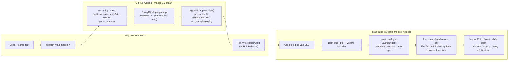

# Build pipeline — code trên Windows, build bộ cài `.pkg` trên CI, dùng thử trên Mac

> **Phần 7/7** · trước: [06-conventions.md](06-conventions.md) · mục lục: [README.md](README.md)
>
> Chốt 2026-09-25: **không có máy Mac để dev**. Đầu ra là **một bộ cài `Ky-so-plugin.pkg`** — định dạng bộ cài chuẩn
> của macOS, tương ứng `.exe` NSIS bên Windows. Đích: **Mac đời mới, macOS 14+** — ưu tiên chip M,
> hỗ trợ thêm Mac Intel đời mới khi được (universal binary).

## Định dạng: Windows → macOS

| Windows | macOS | Ghi chú |
|---|---|---|
| `Ký số plugin.exe` (chương trình) | `Ký số plugin.app` | Thứ chạy nền, nằm trong bộ cài |
| Bộ cài `.exe` NSIS có wizard (`bo-cai.nsi`) | **`.pkg`** (`pkgbuild` + `productbuild`) | Bấm đúp mở Installer.app: Giới thiệu → Nơi cài → Cài → Xong; có script sau cài |
| — | `.dmg` | Chỉ là **ảnh đĩa đựng file**, không có wizard hay script — **không dùng** |

## Vì sao không build thẳng trên Windows

| Đường | Kết luận |
|---|---|
| `cargo build --target aarch64-apple-darwin` trên Windows | ❌ Cần linker + SDK macOS để link `AppKit`, `Security`, `PCSC`; `pkgbuild` chỉ có trên macOS |
| `cargo-zigbuild` | ❌ Chỉ chạy trên host Linux/macOS; link framework vẫn đòi macOS SDK |
| WSL + osxcross + SDK chép từ Xcode | ⚠️ Giấy phép Xcode/SDK chỉ cho dùng trên máy Apple — **không chọn** |
| **GitHub Actions `macos-15` (arm64)** | ✅ Mac chip M thật, có Xcode, `pkgbuild`, `productbuild`; repo **công khai** nên runner chuẩn miễn phí |

## Luồng



## Trình cài đặt — soi gương `bo-cai.nsi`

| Trang bộ cài Windows | Wizard `.pkg` trên Mac | Cách làm |
|---|---|---|
| Chào mừng | **Giới thiệu** | `<welcome file="welcome.html">`, cùng lời văn |
| Chọn thư mục cài (`%LocalAppData%\KySoPlugin`) | **Nơi cài** | Chỉ bật `enable_currentUserHome` ⇒ cài vào `~/Applications`, không quyền quản trị. `.pkg` không cho chọn thư mục tuỳ ý — khác duy nhất so với Windows |
| **Chọn môi trường** Production / Staging / Development | **Tuỳ chỉnh** (Customize) | Ba *choice* loại trừ nhau trong `distribution.xml` (JavaScript `selected`), mặc định Production. Mỗi choice mang một gói con ghi `environment` |
| Tiến độ: tắt bản đang chạy · cài middleware · chép file · ghi registry · autostart · trình gỡ | **Cài đặt** | `preinstall` tắt bản cũ; **không** cài middleware (bản Mac nói PC/SC trực tiếp); `postinstall` ghi config, LaunchAgent |
| Hoàn tất + ô "Chạy ngay" | **Tóm tắt** | `<conclusion>`: "Quay lại trang ký số và bấm Kiểm tra lại". `postinstall` luôn mở app (Installer không có ô tick) |
| `go-cai-dat.exe` + Apps & Features | Menu **"Gỡ cài đặt"** trong app | `Contents/Resources/uninstall.sh`, gọi từ menu; macOS không có Apps & Features |

Registry `HKCU\Software\KySoPlugin` (`ThuMucCai`, `MoiTruong`) ⇒ `~/Library/Application Support/KySoPlugin/config.json`
`{ "installDir": "...", "environment": "Production" }`, app đọc lúc khởi động (component `InstallConfig`, soi gương
`CauHinhCaiDat`). `environment` quyết định mức log (`Development` = debug); origin vẫn ghim trong `DEFAULT_ORIGINS`.

```text
packaging/macos/
├─ distribution.xml   title · welcome · license · conclusion · domains (currentUserHome) · 3 choice môi trường
├─ resources/         welcome.html · conclusion.html (tiếng Việt, cùng lời bộ cài Windows) · icon
├─ components/        env-production.pkg · env-staging.pkg · env-development.pkg (chỉ mang file đánh dấu môi trường)
└─ scripts/
   ├─ preinstall      có bản đang chạy ⇒ yêu cầu nó thoát (đóng session), đợi nhả SingleInstanceLock
   └─ postinstall     ghi config.json · ghi LaunchAgent · launchctl bootstrap gui/<uid> · mở app
```

- **Cập nhật** = chạy `.pkg` bản mới: `preinstall` tắt bản cũ, ghi đè, `postinstall` mở lại — y như chạy lại `.exe`.
- ⚠️ Script `.pkg` có thể chạy dưới `root` tuỳ domain cài: `postinstall` phải tự lấy người dùng đang ngồi máy
  (`stat -f%Su /dev/console`) rồi chạy `launchctl`/`open` **dưới quyền người đó**, không để file của `root` trong `~`.
  Hành vi thật đo ở bước 5; không được thì lùi về cài `/Applications` (hỏi mật khẩu quản trị một lần).
- Không tự tải middleware hay binary nào — `.pkg` chỉ mang đúng app của mình.

## Quy tắc

- **Universal binary**: build `aarch64-apple-darwin` + `x86_64-apple-darwin` trên cùng runner chip M, `lipo` gộp, rồi
  `codesign -s -` **sau `lipo`** (gộp là phá chữ ký). `LSMinimumSystemVersion = 14.0`: Mac chip M mọi đời và Mac
  Intel chạy được Sonoma (khoảng 2018 trở về sau).
- **Mức hỗ trợ**: chip M là **đích chính** — mọi bản phải cài thử trên chip M. Intel là **hỗ trợ khi được**: có máy Intel
  thì thử, không có thì không chặn phát hành. Lý do: Rust hạ `x86_64-apple-darwin` xuống Tier 2 từ 1.90 (lỗi riêng
  Intel ít được bắt hơn), và macOS 26 là bản cuối cho Intel — Intel sẽ dần hết đời.
- Phần `cfg(target_os = "macos")` (`platform`, `PinDialog`, `MenuBar`) **chỉ CI biên dịch được** — mỗi push đụng
  `MacOS/**` đều chạy workflow `.github/workflows/macos.yml`; tag `macos-v*` đính `.pkg` vào GitHub Release.
- `.pkg` là **một file** (flat package) nên chép qua Windows/USB an toàn — quyền, symlink, `_CodeSignature` nằm bên
  trong. **Không** chép thẳng thư mục `.app` qua Windows: NTFS/exFAT làm mất bit thực thi.
- Chép USB từ Windows: **không** dính `com.apple.quarantine` (do trình duyệt/AirDrop *trên Mac* gắn) ⇒ `.pkg` chưa ký
  vẫn mở được bằng Installer. Tải `.pkg` bằng Safari trên Mac thì bị chặn — phát qua web chỉ sau khi ký Developer ID
  Installer + notarize (bước 9).
- **Test không cần ngồi trước Mac**: menu "Xuất báo cáo chẩn đoán" trong app gom phiên bản macOS, chip, đầu đọc, ATR,
  dump PKCS#15 (công khai), kết quả tự gọi `trang-thai`/`chung-thu-so`, trust cert loopback, LaunchAgent,
  `pkgutil --pkg-info`, 3 file log gần nhất — thành một `.zip` trên Desktop. Không PIN, không dữ liệu đem ký.

⚠️ Chữ ký ad-hoc có thể chạy trên runner mà hỏng trên máy khác — mỗi `.pkg` phải được cài thử trên Mac đích.

> Hết kiến trúc. Kế hoạch thi công: [../plan/README.md](../plan/README.md).
