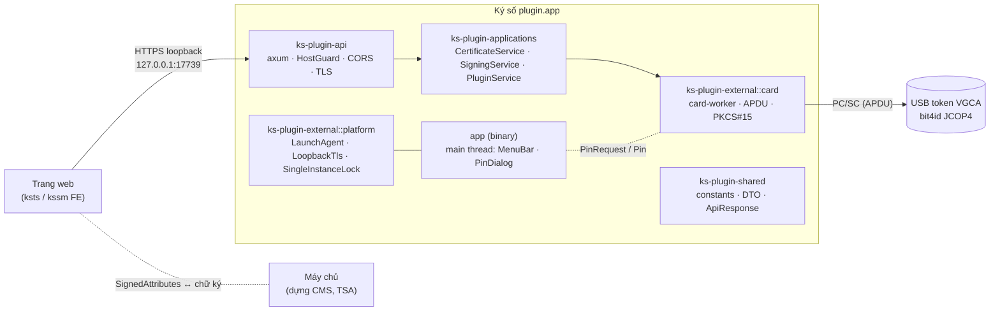

# Kiến trúc plugin ký số macOS (Rust)

> 📝 **Chờ duyệt — chưa có dòng code nào.** Viết 2026-09-25. Nền: bộ khảo sát [../README.md](../README.md).
> Hợp đồng phải thoả: [../../../Window/docs/plugin-ky-so.contract.md](../../../Window/docs/plugin-ky-so.contract.md).
> Kế hoạch thi công từng bước: [../plan/README.md](../plan/README.md).

## Một câu

Một tiến trình Rust chạy nền trên menu bar, nghe `127.0.0.1:17739`, nói **thẳng với token VGCA qua PC/SC**
(không driver hãng, không PKCS#11), trả **đúng sáu route và envelope** như bản Windows.

Trang web là **người đưa thư**: lấy `SignedAttributes` từ máy chủ, đưa xuống plugin ký, mang chữ ký thô về. Mọi
layer trong khung đều chỉ phụ thuộc về phía `ks-plugin-shared` (không vẽ mũi tên cho gọn).

## Ràng buộc cứng

| # | Ràng buộc | Vì sao |
|---|---|---|
| 1 | Giữ **nguyên** route, tên trường JSON, enum ra số, envelope `{ status, data, code, message }` | FE và hai backend không sửa dòng nào (trừ chỗ scheme, xem D2 ở plan) |
| 2 | `thumbprint` = SHA-1 của DER chứng thư, hex **HOA** — y như `X509Certificate2.Thumbprint` | Template phía máy chủ lưu thumbprint; cùng một cert phải ra cùng một chuỗi trên hai hệ |
| 3 | Ký = **SHA-256 do plugin tự băm** + `DigestInfo` + RSA PKCS#1 v1.5 | Bản Windows gọi `SignData(SHA256, Pkcs1)`: máy chủ gửi `SignedAttributes` thô, không gửi hash |
| 4 | Liệt kê chứng thư **không** cần PIN; chỉ `kiem-tra-token` và `mo-phien` chạm PIN | Giữ đúng hành vi đã công bố |
| 5 | Không cache chứng thư xuống đĩa; không log PIN, không log dữ liệu đem ký | Nguyên tắc bảo mật ở README gốc |
| 6 | Thiết bị chỉ chạm từ **một thread**; mọi lời gọi PC/SC là blocking | Tuần tự như `lock (_khoa)` bên C#, không treo worker tokio |

⚠️ Ràng buộc "plugin không chạm PIN" của README gốc **không giữ được** trên macOS — không còn middleware vẽ hộp
PIN hộ. **D1 đã duyệt** (2026-09-25): plugin tự dựng UI hộp PIN, xem [05-macos-platform.md](05-macos-platform.md).
Đích: **macOS 14+, chip M là chính, Mac Intel đời mới hỗ trợ thêm** (universal binary); không có máy Mac để dev — xem [07-build-pipeline.md](07-build-pipeline.md).

## Mục lục — đọc theo thứ tự

| Phần | Nội dung |
|---|---|
| [01-workspace.md](01-workspace.md) | Cargo workspace, năm crate, chiều phụ thuộc, ánh xạ từ `ks.plugin` (C#) |
| [02-threading.md](02-threading.md) | Threading model: `main` (AppKit), `tokio`, `card-worker`, `card-watcher`; channels giữa chúng |
| [03-card-layer.md](03-card-layer.md) | Card layer: PC/SC transport, APDU, PKCS#15, `Bit4idVgcaDriver`, PIN retry guard |
| [04-api-layer.md](04-api-layer.md) | API layer: sáu route axum, DTO serde, envelope, CORS, `HostGuard`, loopback TLS |
| [05-macos-platform.md](05-macos-platform.md) | macOS platform: `MenuBar`, `PinDialog`, `LaunchAgentInstaller`, `SingleInstanceLock`, `LoopbackTls`, logging, app bundle |
| [06-conventions.md](06-conventions.md) | Coding conventions: naming, error handling, logging, dependencies, forbidden |
| [07-build-pipeline.md](07-build-pipeline.md) | Build pipeline: code trên Windows → GitHub Actions `macos-15` build + ký ad-hoc → bộ cài `.pkg` (tương ứng `.exe` NSIS) → USB → Mac bấm đúp là cài và chạy |

> **Tiếp:** [01-workspace.md](01-workspace.md) — năm crate và chiều phụ thuộc.
