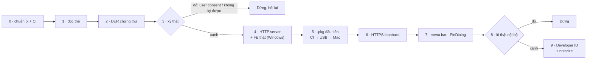

# Kế hoạch plugin ký số macOS (Rust)

> 📝 **Mọi quyết định D1–D5 đã chốt; kế hoạch chờ duyệt để bắt đầu bước 0 — chưa code.** Viết 2026-09-25. Kiến trúc: [../architecture/README.md](../architecture/README.md).
> Khảo sát nền: [../README.md](../README.md). Hợp đồng phải thoả:
> [../../../Window/docs/plugin-ky-so.contract.md](../../../Window/docs/plugin-ky-so.contract.md).

## Nguyên tắc xếp bước

Việc **rủi ro nhất làm trước**, và làm **trên Windows với token đang có** cho tới khi hết rủi ro về thẻ — PC/SC và APDU
giống hệt nhau trên hai hệ. **Không có máy Mac để dev**: GitHub Actions `macos-15` build và đóng **bộ cài
`Ky-so-plugin.pkg`** — định dạng bộ cài chuẩn của macOS, tương ứng `.exe` NSIS bên Windows, có đủ wizard như
`bo-cai.nsi`. Tải về Windows, chép USB mang sang Mac, bấm đúp là cài và chạy — xem [../architecture/07-build-pipeline.md](../architecture/07-build-pipeline.md). Bước nào đỏ thì dừng lại hỏi.

## Các bước

| # | Bước | Ở đâu | Mắt xích ([../03-kha-thi-rust.md](../03-kha-thi-rust.md)) | Chặn bởi |
|---|---|---|---|---|
| 0 | [00-chuan-bi.plan.md](00-chuan-bi.plan.md) — cài Rust, workspace rỗng, workflow CI macOS | Windows + CI | — | — |
| 1 | [01-doc-the.plan.md](01-doc-the.plan.md) — đọc PKCS#15 chỉ-đọc bằng `ks-probe` | Windows | 2 | — |
| 2 | [02-chung-thu.plan.md](02-chung-thu.plan.md) — lấy DER chứng thư (giải nén `7A` hoặc `.cer` dự phòng) | Windows | 3 | — |
| 3 | [03-ky-that.plan.md](03-ky-that.plan.md) — `VERIFY` + ký thật trên **token dự phòng** | Windows | 4, 5 | — |
| 4 | [04-may-chu-api.plan.md](04-may-chu-api.plan.md) — sáu route axum, chạy với FE thật | Windows | — | — |
| 5 | [05-len-macos.plan.md](05-len-macos.plan.md) — `.pkg` đầu tiên (wizard tối thiểu), chẩn đoán đầu đọc và thẻ | CI → USB → Mac | 1 | — |
| 6 | [06-https-loopback.plan.md](06-https-loopback.plan.md) — TLS loopback, cài tin cậy, Safari | CI → USB → Mac | 6 | — |
| 7 | [07-vo-macos.plan.md](07-vo-macos.plan.md) — menu bar, hộp PIN tự dựng, LaunchAgent, canh rút token | CI → USB → Mac | — | — |
| 8 | [08-dong-goi-chay-thu.plan.md](08-dong-goi-chay-thu.plan.md) — trình cài đặt đầy đủ như bản Windows, dùng thử **lô thật** | CI → USB → Mac | 7 | — |
| 9 | [09-phat-hanh.plan.md](09-phat-hanh.plan.md) — Developer ID + notarize, phát `.pkg` qua web | CI | 7 | bước 8 xanh |

**Mốc quyết định**: cuối bước 3 (ký được chứng thư Ban Cơ yếu bằng Rust hay không) và cuối bước 8 (lô thật trên
Safari có đáng đầu tư tiếp không). Tới hết bước 8 chưa tốn phí Apple nào.

## Đã chốt (2026-09-25)

- **D1 — PIN đi qua plugin, plugin tự dựng UI hộp PIN**: cửa sổ AppKit riêng với `NSSecureTextField` (Secure Event
  Input), PIN trong `Zeroizing`, xoá ngay sau `VERIFY`, **không cache**, hỏi lượt thử trước và chặn khi ≤ 1. Còn phải
  sửa README gốc + contract: ngoại lệ riêng bản macOS.
- **D3 — Mac đời mới, macOS 14+**: universal binary (chip M + Intel). Chip M là đích chính, phải thử mọi bản; Mac
  Intel đời mới hỗ trợ thêm, có máy thì thử, không có thì không chặn phát hành.
- **Không có máy Mac để dev**: code trên Windows, CI `macos-15` build; đầu ra là **bộ cài `.pkg`** với wizard soi gương
  `bo-cai.nsi` (Giới thiệu → Nơi cài → Chọn môi trường → Cài đặt → Tóm tắt) và menu "Gỡ cài đặt" thay `go-cai-dat.exe`;
  cài per-user vào `~/Applications`, không quyền quản trị — giống `%LocalAppData%` bên Windows.
- **D2 — HTTPS trên loopback**: bản Mac chỉ HTTPS trên `127.0.0.1:17739` (Safari chặn `http://` từ trang `https://`).
  FE của `ksts` và `kssm` phải dò `https://` trước, trượt thì `http://` — việc ngoài repo này, cần bàn giao.
- **D4 — chỉ token Ban Cơ yếu** (bit4id JCOP4, RSA) ở bản đầu; token MISA/FPT/VNPT hiện "chưa hỗ trợ", thêm sau bằng
  driver mới sau `CardDriver`.
- **D5 — tên theo bản Windows**: app `Ký số plugin.app` (như `Ký số plugin.exe`), tên hiển thị trong bộ cài
  "Plugin ký số", thư mục dữ liệu `KySoPlugin`, bundle id `vn.ynap.kysoplugin` (theo nhà phát hành `YnaP` của
  `bo-cai.nsi`). Bundle id đi vào `Info.plist`, LaunchAgent, keychain — đổi sau bản phát đầu là máy đã cài phải gỡ tay.
- **Bỏ route `ky-so/do-toc-do`** — sáu route thay vì bảy; bản Windows bỏ theo ngày 2026-10-05. Đo `T` khi phát
  triển bằng `ks-probe bench`.
- Tên thành phần trong code và kiến trúc là **tiếng Anh**; route và tên trường JSON giữ tiếng Việt của hợp đồng.

⚠️ Bước 3 còn một ẩn số có thể lật D1: nếu khoá trên thẻ mang thuộc tính *user consent*, thẻ đòi `VERIFY` trước
**mỗi** chữ ký ⇒ "một PIN cho cả lô" chỉ giữ được bằng cách cache PIN, mà cache PIN là cấm. Gặp thì dừng, hỏi lại.

## Ngoài phạm vi kế hoạch này

Job ticket, WYSIWYS, topology B, pairing — 🔬 nghiên cứu ở
[../../../Window/docs/bao-mat-agent-ky-so.md](../../../Window/docs/bao-mat-agent-ky-so.md); bản Mac làm khi bản
Windows làm, qua cùng hợp đồng. Dùng chung lõi PC/SC cho cả Windows — chỉ bàn sau khi bản Mac chạy thật.

> **Tiếp:** [00-chuan-bi.plan.md](00-chuan-bi.plan.md) — dựng môi trường, workspace rỗng và CI.
